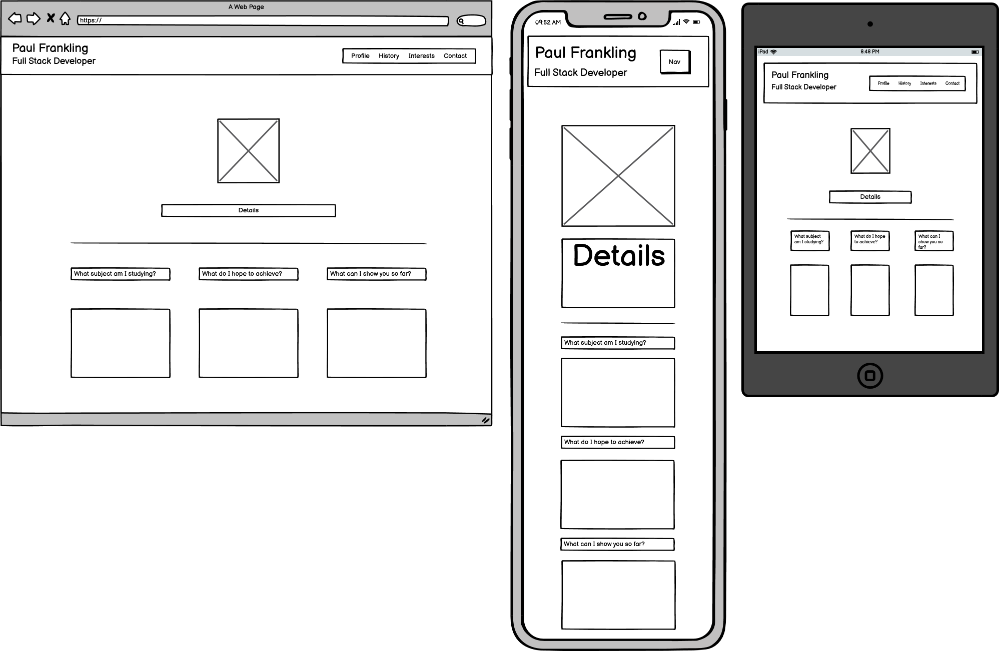
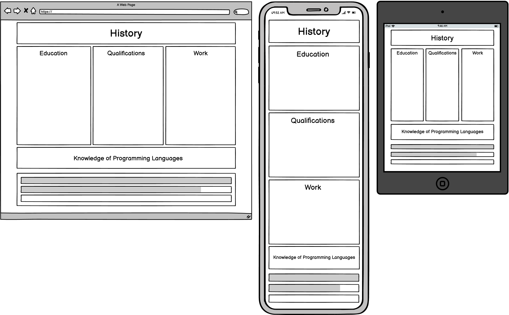
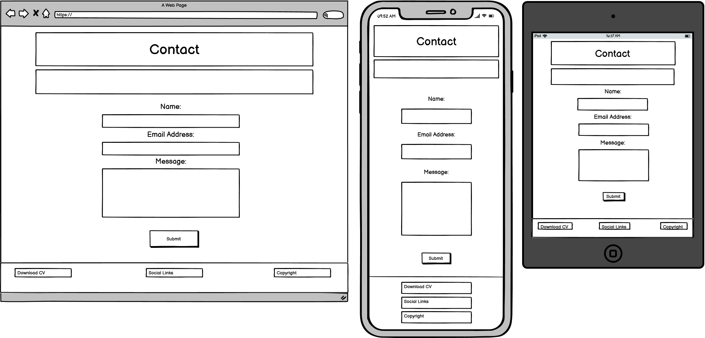

# First Milestone Project - My Online CV

I designed this project with the ambition of creating a user friendly website. Whilst I wanted to present something unique, making the website
easy to navigate around was key to the formation of the site. My target audience would predominantly be future employees or other web developers and I wanted to make a big impression by designing something clear and concise.

## User Experience:

* ### User Stories

  * #### First Time Visitor Goals
  1. As a First Time Visitor, I want to understand the purpose of the webpage and learn more about the person through their Online CV.
  1. As a First Time Visitor, I want to navigate easily around the website to find content.
  1. As a First Time Visitor, I want to 

  * #### Returning Visitor Goals
  1. As a Returning Visitor,
  1. As a Returning Visitor,
  1. As a Returning Visitor,

  * #### Frequent User Goals
  1. As a Frequent User, 
  1. As a Frequent User, 
  1. As a Frequent User, 

## Design:

### Colour Scheme

The colour scheme of the webpage is Space Cadet, Independence, Silver, White and Mandarin.

### Typography

The website uses the font of *Quicksand* and the font of *Open-sans* is used as backup font in case of any difficulty to present the primary font of *Quicksand*.

### Imagery

In the **Profile section**, I have used a professionally presented image to suit the purpose of the website, which is providing a good impression to an employer or potential colleague.

### Wireframes

* **Profile section** (Including header) wireframe - 
* **History section** wireframe - 
* **Interests section** wireframe - 
* **Contact section** (Including footer) wireframe - 

## Features:

* Interactive elements.
* Responsive on all device screen sizes.

## Technologies used:

### Programming Languages

* HTML5
* CSS3

### Framework, Libraries and Programs

1. [Bootstrap 4.5](https://getbootstrap.com) 
   * Bootstrap was used to make the site responsive and help with styling and establishing the layout.
1. [Google Fonts](https://fonts.google.com)
   * I used Google Fonts to import the font *'Quicksand'* to my style.css which was used all throughout the website.
1. [Font Awesome](https://fontawesome.com)
   * Font Awesome was used to add icons to my website to deliver a better UX.
1. [Coolor](https://coolors.co)
   * I used Coolor to provide a colour scheme for the website and for UX purposes.
1. [Hover.css](https://ianlunn.github.io/Hover/)
   * I added Hover.css to my navbar links as well as my social media icons, submit button and cv download icon to add colour change when hovered over.
1. [jQuery](https://jquery.com/)
   * jQuery was used to stop the contact form increasing its width fully on a large screen for the UX.
1. [Balsamiq](https://balsamiq.com/wireframes/desktop/)
   * I used Balsamiq to create my wireframes for the project.  
1. [Git](https://git-scm.com/)
   * I used Git for version control and to commit and push code to GitHub.
1. [GitHub](https://github.com/)
   * GitHub was used to store projects pushed from Git.

## Testing:

## Deployment:

### GitHub Pages

This project was deployed to GitHub Pages taking the following steps:

1. Sign in to GitHub and locate the GitHub Repository.
1. Select 'Settings' from the menu near the top.
1. Scroll down until you reach the GitHub Pages section.
1. Under 'Source' click the dropdown menu called 'none' and select 'Master Branch'.
1. The page then automatically refreshes...
1. The Website is now deployed. Scroll down to GitHub Pages section to retrieve the newly published link.

## Credits:

### Code
   * [Bootstrap 4.5](https://getbootstrap.com): Bootstrap was used significantly throughout the project to make it responsive. I used the Grid system as well as inputting a navbar, a progress bar and contact form.
   * [Stack Overflow](https://stackoverflow.com/) was used to help me style the navbar text colour.
   * [W3Schools](https://www.w3schools.com/) was used to provide a smooth scroll to the website and to style the contact form, download CV button and the submit button.
   * [Courses.Code Institute](https://courses.codeinstitute.net/courses/course-v1:codeinstitute+FE+2017_T3/course/) was used to style the progress bars and used the jQuery for the contact form.
   * [Solodev](https://www.solodev.com/blog/web-design/how-to-change-icon-colors-and-background-colors-on-hover.stml) was used to apply a hover for the footer icons.
   * [Grepper](https://www.codegrepper.com/code-examples/css/how+to+remove+blue+color+in+anchor+tag) was used to remove blue link from the button in my **Profile Section**.
   * [Gauger](https://gauger.io/fonticon/) was used to design and download my favicon.

### Content
   * All content was produced and written by the developer

### Media used
   * All images and pdf files were provided by the developer.

### Acknowledgements
   * My Mentor for his highly constructive help.
   * The Code Institute's tutor support for quickly assisting with any problems or queries.